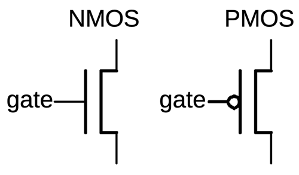

# PMOS vs NMOS Transistors

## PMOS (P-channel Metal-Oxide-Semiconductor) Transistors:
- Pass logic '1' (high voltage) well
- Pass logic '0' (low voltage) poorly

## NMOS (N-channel Metal-Oxide-Semiconductor) Transistors:
- Pass logic '0' (low voltage) well
- Pass logic '1' (high voltage) poorly

### NMOS:

| Gate Voltage (V_GS)    | Source-Drain Current (I_DS) | Transistor State |
|------------------------|-----------------------------|------------------|
| High (Logic 1)         | High                        | ON               |
| Low (Logic 0)          | Low                         | OFF              |

### PMOS:

| Gate Voltage (V_GS)    | Source-Drain Current (I_DS) | Transistor State |
|------------------------|-----------------------------|------------------|
| Low (Logic 0)          | High                        | ON               |
| High (Logic 1)         | Low                         | OFF              |

## Key Points:
1. When you need to output a strong high voltage (logic '1'), a PMOS transistor is better because it will provide a good connection to VDD (power supply).
2. When you need to output a strong low voltage (logic '0'), an NMOS transistor is better because it will provide a good connection to ground.

This complementary behavior is why modern digital circuits often use CMOS (Complementary MOS) technology, which combines both types of transistors. In a typical CMOS inverter, for example, a PMOS transistor pulls the output to logic '1' and an NMOS transistor pulls it to logic '0', ensuring strong output signals in both states.

## Physics Behind the Asymmetric Behavior:
The reason for this asymmetric behavior relates to the physics of these devices. PMOS transistors use holes as charge carriers and connect well to the positive supply, while NMOS transistors use electrons and connect well to ground.
